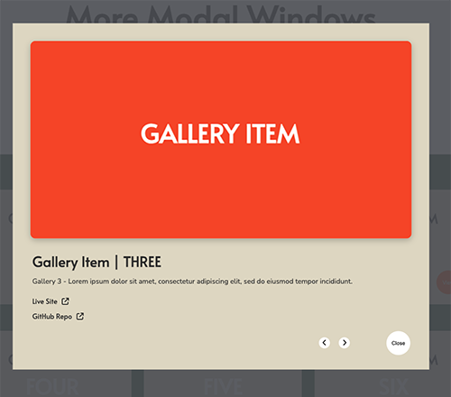

# Modal Windows
These modal windows appear in front of the web page to display information about content items. Users can navigate between modal windows without first returning to the web page. Built with JavaScript, ES6 modules, HTML5, CSS3, and Flexbox.

## About
This project uses modal windows to display additional details about content items on a web page. When a user clicks on an item, a modal window appears on a blurred backdrop in front of the page, revealing further information about the selected item. 

Once a modal window is open, users can navigate to the previous or next item’s window without first having to close the window and return to the web page. The event handling allows for user interaction with mouse (clicks) or keyboard navigation.  

## Project Background
My objective for designing and building the Modal Windows project was to:

- better understand how to use ES6 modules to separate and reuse code across web components, 
- practice data handling, and 
- practice DOM manipulation. 

The project consists of two separate modal window components — sharing the same layout, but featuring different contents — on the same web page. The script’s use of JavaScript modules allows for the modal window functionality to be reused and applied to both components.  

Main features of the Modal Windows project:

- The code is separated into three ES6 modules:

- The **main.js** module: Includes an IIFE that runs on page load and calls a function in the modal.js module to add event listeners to each content item’s HTML element on the web page. The event listeners detect and identify the user’s selection of modal. 

- The **modalData.js** module: Stores the data for both modal window components on the page. Each modal window’s data is stored in an object, and objects belonging to the same modal window component are stored together in an array. 

    A function combines the modal data arrays in a two-dimensional array. The function is exported and called in the modal.js module where it is used to fetch the modal window data for further processing.   

- The **modal.js** module: This module is reusable and free of data as it relates to specific modal window content and will work with the data provided via the two other modules. The modal.js module processes and renders the user's selection of modal. This includes: 

    - applying event listeners for detection and identification of the user’s selection of modal, 
    - finding and returning the data for the selected modal, and 
    - dynamically rendering the selected modal's HTML and data to the web page via the DOM.

    The modal.js module utilizes the **Model View Controller** design to help organize the code: 

- The **Model** portion contains a factory function which gets the modal window data from the modalData.js module. The factory function dynamically creates and returns a new object populated with data specific to the selected modal, depending on parameters such as the type of modal (new, previous, or next) and id attribute values passed from the Controller. 

    — To that end, helper functions, loops, and if statements go through the outer (two-dimensional) and inner (one-dimensional) arrays holding the modal window data in order to locate and return the data that matches the user’s modal selection.

    To enable navigation between modals, a helper function moves through the modal data array in a ‘circular’ fashion to ensure that the ‘previous’ or ‘next’ modal is returned and that the modal window, once it reaches the last of its modals, starts over again. 

- The module’s **View** holds a function that dynamically creates and renders the HTML markup and styling for the modal windows and adds data for the selected modal.

    The function also adds event listeners to detect for modal type selection (new, previous, or next): ‘Click’ (mouse) event listeners to modal window navigation buttons and ‘keyup’ (keyboard) to the body element. 

    Finally, it selects and stores the id attribute value of the currently open modal window if applicable, passing it to the Controller to help get the data for the previous or next window.  

- The **Controller** portion receives modal type and identification data as parameters from the View. An event handler processes the data and calls the Model while passing the type of modal and id attribute value as arguments.

    The Controller then passes the modal window data object returned from the Model on to the View for rendering to the web page.     

## Built With 
- JavaScript
- ES6 modules
- HTML5 
- CSS3 
- Flexbox

## Launch
[See the live version of the Modal Windows project here.](https://lonemortensen.github.io/modal-window/)